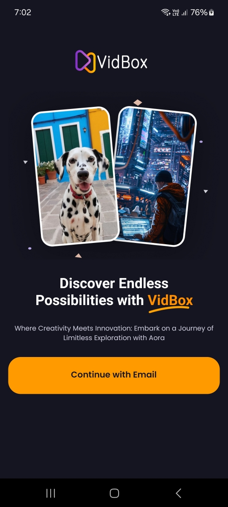

<h1 align="center" >  VidBox App   ♨ [ ʀᴇᴀᴄᴛ ɴᴀᴛɪᴠᴇ ᴇxᴘᴏ ᴘʀᴏᴊᴇᴄᴛ ] ♨</h1>

## Stage 05: Intro/Welcome Screen  
**Log:** January 12, 2025  

This stage involves creating and implementing the Intro/Welcome Screen UI and building reusable custom components for a seamless user experience.  

---

## Step-by-Step Process  

### 1. Intro/Welcome Screen UI  
The Intro/Welcome Screen UI has been implemented in:  
**File Location**: `/app/index.jsx`  
👉 [View the `index.jsx` code here](./app/index.jsx)  

---

### 2. Custom Component for Intro/Welcome Screen UI  
A reusable custom component (`CustomButton`) for the Intro/Welcome Screen UI has been implemented in:  
**File Location**: `/components/CustomButton.jsx`  
👉 [View the `CustomButton.jsx` code here](./components/CustomButton.jsx)  

 

---

 

---
 

🚀 See You in the Next Step for the Development Process!  

