<h1 align="center" > 
✦ VidBox App ✦ <br> 
♨ [ ʀᴇᴀᴄᴛ ɴᴀᴛɪᴠᴇ ᴇxᴘᴏ ᴘʀᴏᴊᴇᴄᴛ ] ♨
</h1>

> [!Note]
> **This project is still in its early development stage.**
#

## ɪ  ⁃  ᴘʀᴏᴊᴇᴄᴛ ɪɴꜰᴏ

**VidBox** is built with React Native and styled with NativeWind. It offers smooth user experiences and features that let users easily share AI videos within the community. The app focuses on great design and functionality.

<br>

<div align="center">

⁃ ᴄᴏɴᴛᴇɴᴛꜱ ⁃  
[ᴜꜱᴇʀ ꜰᴇᴀᴛᴜʀᴇꜱ](#ɪɪ--ᴡʜᴀᴛ-ᴜꜱᴇʀꜱ-ᴄᴀɴ-ᴇxᴘᴇᴄᴛ)
| [ᴀᴘᴘ ꜱᴄʀᴇᴇɴꜱ](#ɪɪɪ--ᴠɪꜱᴜᴀʟ-ᴛᴏᴜʀ-ᴏꜰ-ᴛʜᴇ-ᴀᴘᴘ-ꜱᴄʀᴇᴇɴꜱ)
| [ᴘʀᴏᴊᴇᴄᴛ ʙʀᴀɴᴄʜᴇꜱ](#ɪᴠ--ᴘʀᴏᴊᴇᴄᴛ-ʙʀᴀɴᴄʜᴇꜱ)
| [ᴅᴇᴠ ꜰᴇᴀᴛᴜʀᴇꜱ](#ᴠ--ʙᴇʜɪɴᴅ-ᴛʜᴇ-ᴄᴏᴅᴇ-ᴅᴇᴠ-ꜰᴇᴀᴛᴜʀᴇꜱ)
| [ᴘʀᴏᴊᴇᴄᴛ ɴᴏᴛᴇꜱ](#ᴠɪ--ᴘʀᴏᴊᴇᴄᴛ-ɴᴏᴛᴇꜱ)


<br>

[](#)
[](#)

[](#)
[](#)


[](#)
[](./LICENSE)
<br>
<br>

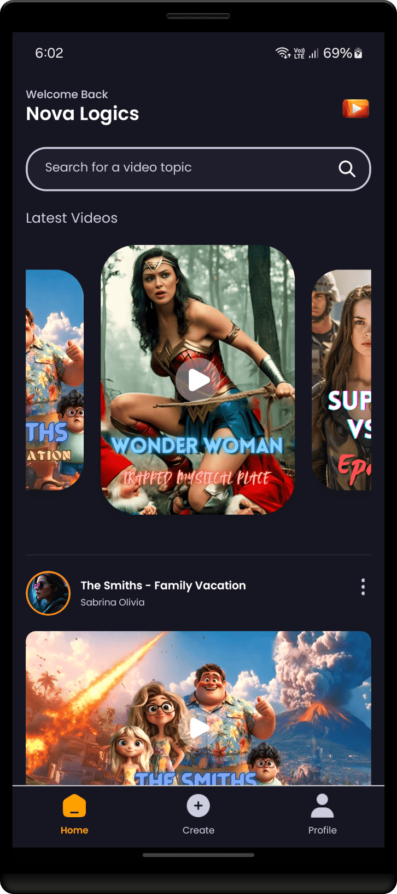
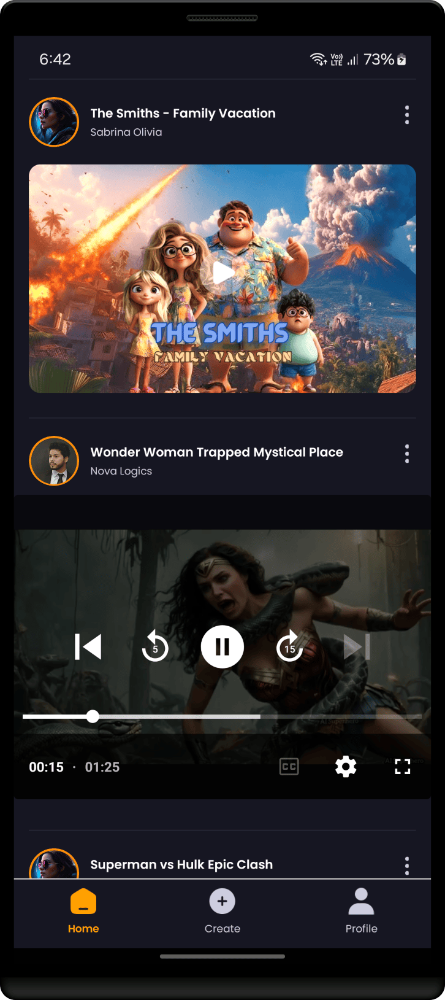

</div>


## ɪɪ ⁃ ᴡʜᴀᴛ ᴜꜱᴇʀꜱ ᴄᴀɴ ᴇxᴘᴇᴄᴛ

### ⭓ Features

### ⭓ Features

- **Onboarding Screen**: Clear instructions and fun graphics to welcome users to the app.
- **Authentication System**: Secure login with email to protect user accounts.
- **Home Screen with Animated Flat List**: Browse the latest videos smoothly with animated lists.
- **Pull-to-Refresh**: Refresh content easily by pulling down the screen to get the latest updates.
- **Full-Text Search**: Search through videos with real-time suggestions and quick results.
- **Tab Navigation**: Easily switch between sections like Home, Search, and Profile.
- **Post Creation**: Upload videos and images directly from the app with a simple media picker.
- **Profile Screen**: View account details, activity, uploaded videos, and follower count.
- **Responsiveness**: Smooth performance across different devices and screen sizes.
- **Animations**: Engaging animations to improve user interaction and experience.
- **Reusable Code Architecture**: Structured code for easy updates and maintenance.
- 

##
### ⭓ Requirements
### **System Requirements**

### Android
- **Android 7.0 (Nougat)** and Above
- **Minimum SDK Version**: 24

### iOS
- **iOS 11.0** and Above

<br/>

<hr/>


## ɪɪɪ ⁃ ᴠɪꜱᴜᴀʟ ᴛᴏᴜʀ ᴏꜰ ᴛʜᴇ ᴀᴘᴘ: ꜱᴄʀᴇᴇɴꜱ


<p align="center">
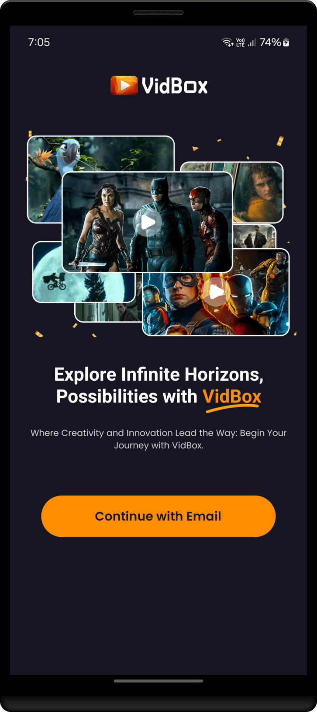
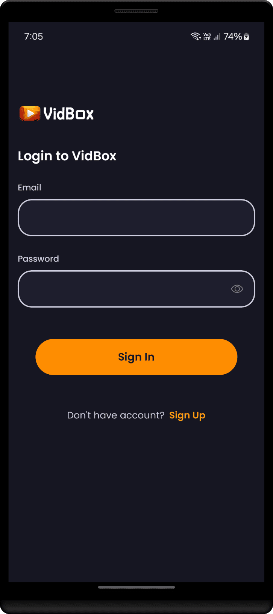
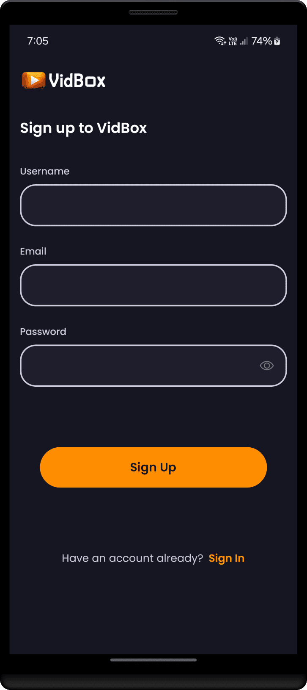

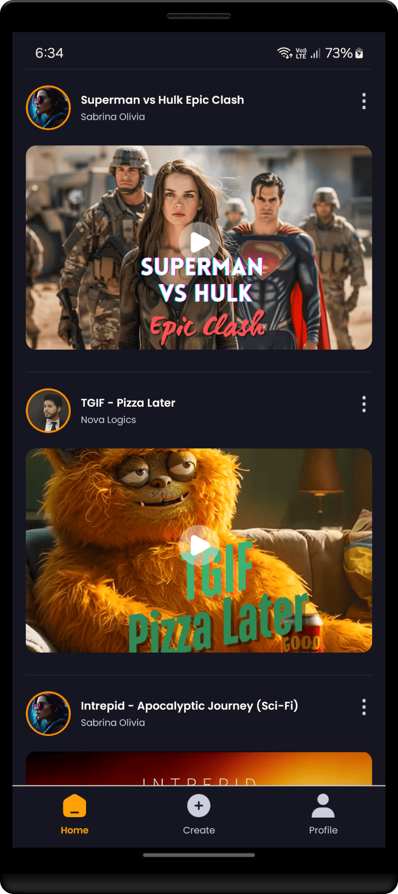

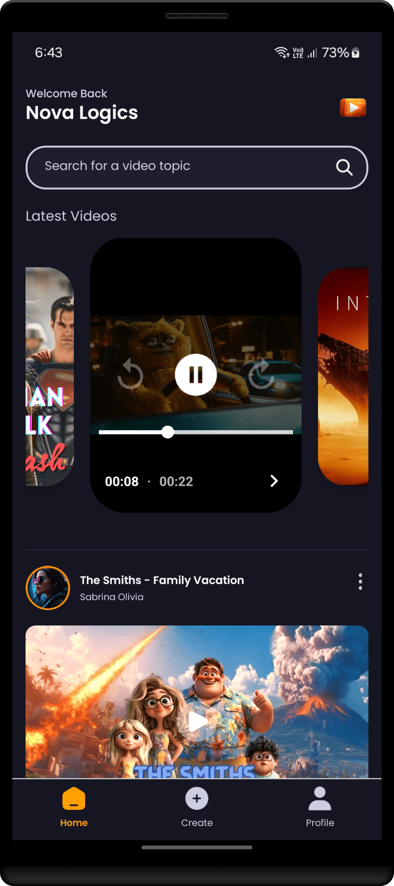
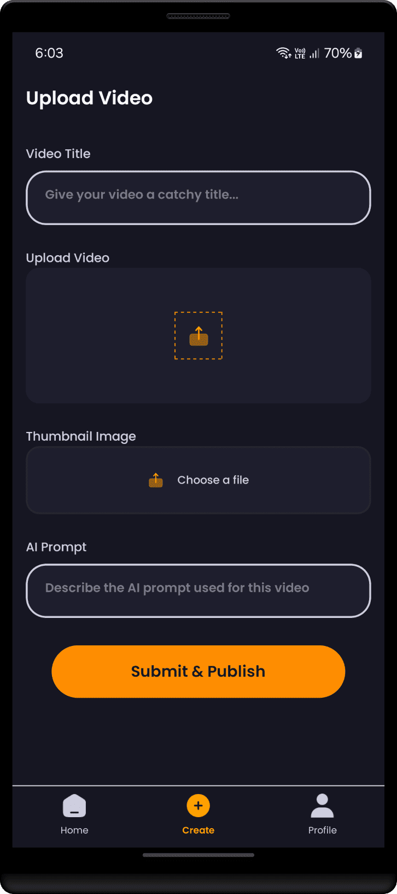
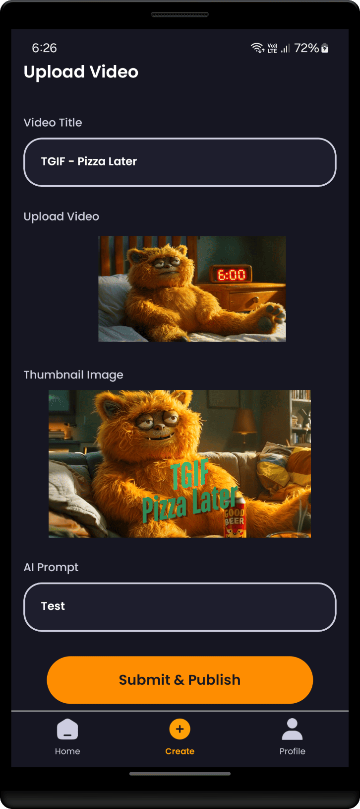
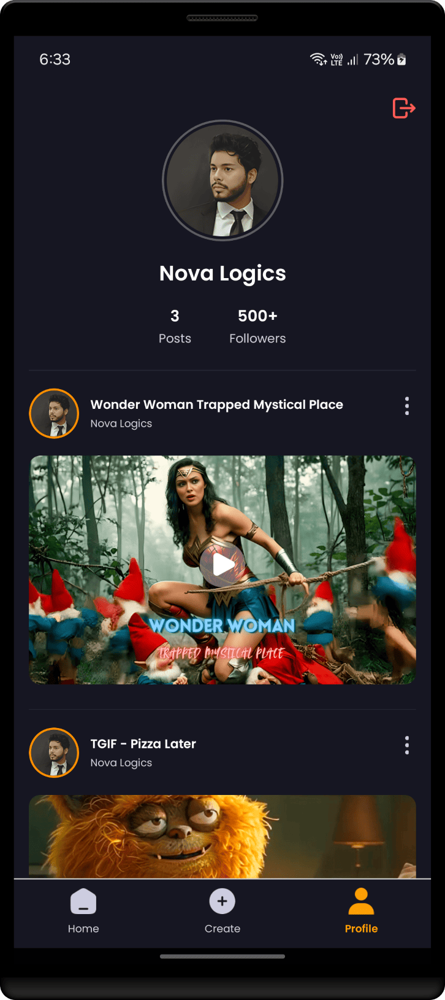
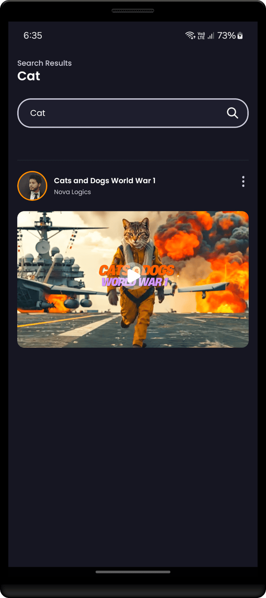
</p>


#
<div align="center">


<br/>

<kbd>[&nbsp; ⮝ &nbsp;  BACK TO TOP  &nbsp;&nbsp;&nbsp;](#ɪ----ᴘʀᴏᴊᴇᴄᴛ-ɪɴꜰᴏ) </kbd>
</div>


#
## ɪᴠ ⁃ ᴘʀᴏᴊᴇᴄᴛ ʙʀᴀɴᴄʜᴇꜱ

<!-- Main / Master / Production Branch -->

> <samp> **PRODUCTION BRANCH :**  </samp>  
> Stable code for deployment  
> ➲ [main][branch-main]


> <samp> **DEVELOPMENT BRANCH :**  </samp>   
> Active codebase for ongoing development efforts  (New features, bug fixes, and improvements..)  
> ➲ [development-next][branch-development]


[branch-main]:  https://github.com/NovaLogics/vidbox-reactnative-expo-app/tree/main

[branch-development]:  https://github.com/NovaLogics/vidbox-reactnative-expo-app/tree/development-next

<br/>

#
### ➲ Code from the scratch ♨
Explore the branches: Stage 1–13

<details>
<summary> <strong> ♨ VidBox React Native Expo App : Branches ♨ </strong> </summary>

#### Branches  

1. **Init Expo Project** [**stage-01-init_expo_project**](https://github.com/NovaLogics/vidbox-reactnative-expo-app/tree/stage-01-init_expo_project)  
   Initial setup of the Expo project.

2. **Project Setup** [**stage-02-project_setup**](https://github.com/NovaLogics/vidbox-reactnative-expo-app/tree/stage-02-project_setup)  
   Completed basic project setup with dependencies.

3. **Project Structure** [**stage-03-project_structure**](https://github.com/NovaLogics/vidbox-reactnative-expo-app/tree/stage-03-project_structure)  
   Organized folder structure for better maintainability.

4. **Tabs UI** [**stage-04-feature_tabs_ui**](https://github.com/NovaLogics/vidbox-reactnative-expo-app/tree/stage-04-feature_tabs_ui)  
   Implemented UI for tabs navigation.

5. **Intro UI** [**stage-05-feature_intro_ui**](https://github.com/NovaLogics/vidbox-reactnative-expo-app/tree/stage-05-feature_intro_ui)  
   Added intro UI screens to welcome the users.

6. **Auth Screens UI** [**stage-06-feature_auth_screens_ui**](https://github.com/NovaLogics/vidbox-reactnative-expo-app/tree/stage-06-feature_auth_screens_ui)  
   Designed UI for authentication screens (sign-in, sign-up).

7. **Backend and Login Integration** [**stage-07-connect_backend_and_login**](https://github.com/NovaLogics/vidbox-reactnative-expo-app/tree/stage-07-connect_backend_and_login)  
   Integrated backend services for login functionality.

8. **Global State Management** [**stage-08-feature_global_state**](https://github.com/NovaLogics/vidbox-reactnative-expo-app/tree/stage-08-feature_global_state)  
   Set up global state management for the app.

9. **Home Screen UI** [**stage-09-feature_home_screen**](https://github.com/NovaLogics/vidbox-reactnative-expo-app/tree/stage-09-feature_home_screen)  
   Designed the main home screen of the app.

10. **Search Screen UI** [**stage-10-feature-search-screen**](https://github.com/NovaLogics/vidbox-reactnative-expo-app/tree/stage-10-feature-search-screen)  
   Implemented UI for the search screen.

11. **Profile Screen UI** [**stage-11-feature-profile-screen**](https://github.com/NovaLogics/vidbox-reactnative-expo-app/tree/stage-11-feature-profile-screen)  
   Designed the profile screen for the user.

12. **Add Videos Feature** [**stage-12-feature-add-videos**](https://github.com/NovaLogics/vidbox-reactnative-expo-app/tree/stage-12-feature-add-videos)  
   Implemented the feature to allow users to add videos.

13. **Loading View** [**stage-13-feature-loading-view**](https://github.com/NovaLogics/vidbox-reactnative-expo-app/tree/stage-13-feature-loading-view)  
   Added a loading view while data is being fetched.

</details>

<br/>

<br/>

#
## ᴠ ⁃ ʙᴇʜɪɴᴅ ᴛʜᴇ ᴄᴏᴅᴇ: ᴅᴇᴠ ꜰᴇᴀᴛᴜʀᴇꜱ

### ⭓ Project Architecture

### Feature-Based Modular Architecture

Feature-Based Modular Architecture organizes an app into independent modules based on features, each containing its own screens and logic. Shared resources like components, API configurations, and constants are placed in dedicated folders. This structure promotes maintainability, scalability, and code reusability.

```plaintext
📂 app/
├── 📂 auth/
│   ├── 📝 _layout.jsx
│   └── 📝 Other screens (e.g., sign-in, sign-up)
├── 📂 tabs/
│   ├── 📝 _layout.jsx
│   └── 📝 Other screens (e.g., home, profile, create)
├── 📂 search/
│   └── 📝 [query].jsx
├── 📝 _layout.jsx
└── 📝 index.jsx

📂 assets/
├── 📂 fonts/
├── 📂 icons/
└── 📂 images/

📂 shared/
├── 📂 api/
│   ├── 📝 config.js
│   └── 📝 other API-related files
├── 📂 components/
│   ├── 📝 Custom components...
│   └── 📝 index.js
├── 📂 constants/
│   ├── 📝 colors.js
│   ├── 📝 strings.js
│   ├── 📝 images.js
│   ├── 📝 icons.js
│   └── 📝 index.js
└── 📂 context/
    └── 📝 GlobalProvider.js

```

#
### ⭓ App Dependencies/Libraries Overview

* [expo][0]: Core Expo SDK for building cross-platform apps.
* [expo-constants][1]: Provides system information and constants, like app version and device information.
* [expo-font][2]: Allows the use of custom fonts in your Expo app.
* [expo-linking][3]: Simplifies deep linking and URL routing in your app.
* [expo-router][4]: Simplifies file-based routing for Expo apps.
* [expo-status-bar][5]: Customizes the status bar appearance in your app.
* [nativewind][6]: Utility-first CSS for React Native apps with Tailwind-style classes.
* [postcss][7]: Tool for transforming CSS with JavaScript plugins (used by NativeWind).
* [react][8]: JavaScript library for building user interfaces.
* [react-native][9]: Core framework for building native mobile apps with React.
* [react-native-animatable][10]: Easy-to-use library for animations in React Native.
* [react-native-appwrite][11]: SDK for integrating Appwrite with React Native apps.
* [react-native-gesture-handler][12]: Gesture handling library for React Native, improving touch interactions.
* [react-native-reanimated][13]: Advanced animation library for React Native.
* [react-native-safe-area-context][14]: Provides safe area insets for handling notches and other UI components.
* [react-native-screens][15]: Optimizes navigation in React Native by managing screen lifecycles.
* [react-native-url-polyfill][16]: Polyfills URL API in React Native for compatibility with web features.
* [expo-av][17]: Provides audio and video playback features in your Expo app.
* [expo-video][18]: Simplifies video playback with Expo, built on top of expo-av.
* [expo-document-picker][19]: Allows users to pick documents from their device.
* [expo-image-picker][20]: Lets users pick images and videos from their device.

#### ⭓ Dev Dependencies Overview

* [@babel/core][21]: Core Babel compiler for JavaScript transformations.
* [tailwindcss][22]: Utility-first CSS framework, used with NativeWind for styling in React Native.

[0]: https://docs.expo.dev/get-started/installation/
[1]: https://docs.expo.dev/versions/latest/sdk/constants/
[2]: https://docs.expo.dev/versions/latest/sdk/font/
[3]: https://docs.expo.dev/versions/latest/sdk/linking/
[4]: https://docs.expo.dev/versions/latest/sdk/router/
[5]: https://docs.expo.dev/versions/latest/sdk/status-bar/
[6]: https://github.com/marko-halik/nativewind
[7]: https://postcss.org/
[8]: https://reactjs.org/
[9]: https://reactnative.dev/
[10]: https://github.com/oblador/react-native-animatable
[11]: https://github.com/appwrite/sdk-for-react-native
[12]: https://docs.swmansion.com/react-native-gesture-handler/
[13]: https://docs.swmansion.com/react-native-reanimated/
[14]: https://github.com/th3rdwave/react-native-safe-area-context
[15]: https://github.com/software-mansion/react-native-screens
[16]: https://github.com/react-native/url-polyfill
[17]: https://docs.expo.dev/versions/latest/sdk/av/
[18]: https://docs.expo.dev/versions/latest/sdk/video/
[19]: https://docs.expo.dev/versions/latest/sdk/document-picker/
[20]: https://docs.expo.dev/versions/latest/sdk/image-picker/
[21]: https://babeljs.io/docs/en/core
[22]: https://tailwindcss.com/


#
# ᴠɪ ⁃ ᴘʀᴏᴊᴇᴄᴛ ɴᴏᴛᴇꜱ

**N/A**