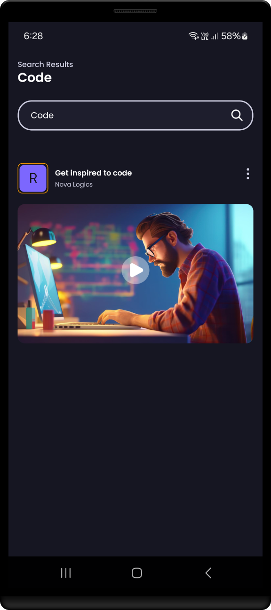
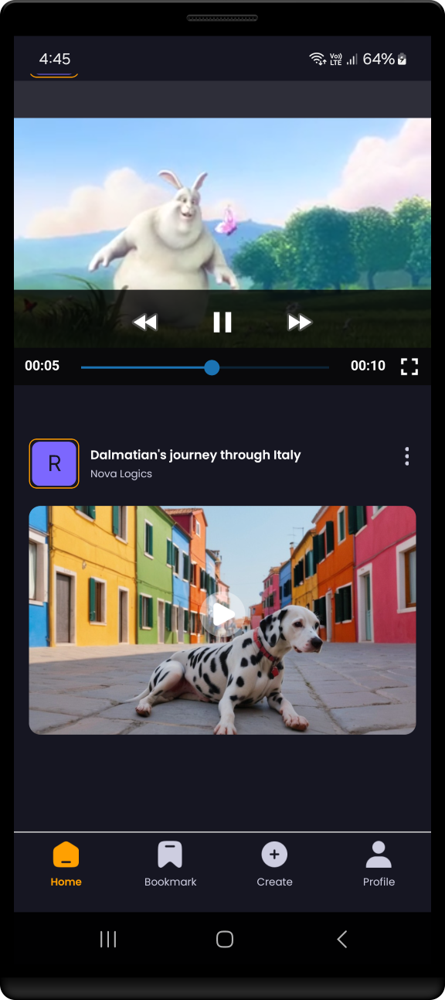

<h1 align="center" >  VidBox App   ♨ [ ʀᴇᴀᴄᴛ ɴᴀᴛɪᴠᴇ ᴇxᴘᴏ ᴘʀᴏᴊᴇᴄᴛ ] ♨</h1>

## Stage 09: Feature Home UI  
**Log:** January 15, 2025  

This stage focuses on implementing the Home UI with custom components like `Trending` and `VideoCard`. The logic to fetch and display the latest posts is integrated with Appwrite.

---

## Step-by-Step Process  

### 1. Implement Home UI  
- Develop the Home UI for the app.

**File Location**: `/app/(tabs)/home.jsx`  
👉 [View the `home.jsx` code here](./app/(tabs)/home.jsx)  

---

### 2. Add & Implement Custom Component: `Trending`  
- Create a `Trending` component to display trending posts or videos.  

**File Location**: `/components/Trending.jsx`  
👉 [View the `Trending.jsx` code here](./components/Trending.jsx)  

---

### 3. Add & Implement Custom Component: `VideoCard`  
- Create a `VideoCard` component to represent individual videos in a card format.  

**File Location**: `/components/VideoCard.jsx`  
👉 [View the `VideoCard.jsx` code here](./components/VideoCard.jsx)  

---

### 4. Add `getLatestPosts` Logic in `Appwrite` File  
- Add logic in the `appwrite` configuration file to fetch the latest posts.  

**File Location**: `/lib/appwrite.js`  
👉 [View the `appwrite.js` code here](./lib/appwrite.js)  

---

### 5. Apply `VideoCard` and `Trending` in Home UI  
- Use the `VideoCard` and `Trending` components to populate the Home UI.  

**File Location**: `/app/(tabs)/home.jsx`  
👉 [View the updated `home.jsx` code here](./app/(tabs)/home.jsx)  

 

---

 

 

---

See you in the next step for the development process! 🚀  

---