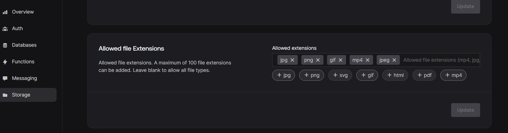

<h1 align="center" >  VidBox App   ♨ [ ʀᴇᴀᴄᴛ ɴᴀᴛɪᴠᴇ ᴇxᴘᴏ ᴘʀᴏᴊᴇᴄᴛ ] ♨</h1>

## Stage 12: Feature Create/Upload Video Screen  
**Log:** January 16, 2025  
This stage focuses on enabling users to create and upload videos to the platform. The screen will include functionalities for file selection and uploading to the backend.  

### Step-by-Step Process  

1. **Implement the Basic UI for the Create Video Screen**  
   Design a simple and intuitive UI for the video creation and upload process.  
   **File:** `/app/(tabs)/create.jsx`  
   **Link:** [create.jsx ->](./app/(tabs)/create.jsx)  

    

   ---  

2. **Install File Picker Libraries**  
   Choose and install one of the following libraries to allow users to pick files:  
   - **Expo DocumentPicker:** [Guide ->](https://docs.expo.dev/versions/latest/sdk/document-picker/)  
   - **Expo ImagePicker:** [Guide ->](https://docs.expo.dev/versions/latest/sdk/imagepicker/)  
   
    
   
   ---

3. **Add Create and Upload Logic**  
   Implement `createVideo` and `uploadFile` functions in the Appwrite configuration file for managing video uploads.  
   **File:** `/app/appwrite.jsx`  
   **Link:** [appwrite.jsx ->](./app/appwrite.jsx)  
   
    
   
   ---  

4. **Update Appwrite Storage Settings**  
   Navigate to the Appwrite dashboard and configure storage to allow specific file extensions.  
   
  
     
   
  

   
    
   
   ---

5. **Integrate Create and Upload Logic into the Screen**  
   Apply the `createVideo` and `uploadFile` functions to the Create Video Screen, enabling the upload process.  
   **File:** `/app/(tabs)/create.jsx`  
   **Link:** [create.jsx ->](./app/(tabs)/create.jsx)  
   
    

---

 

### CREATE SCREEN

 

### OTHER SCREENS

 

---

Now users can easily upload videos to the app! 🎥 See you in the next stage! 🚀  

---