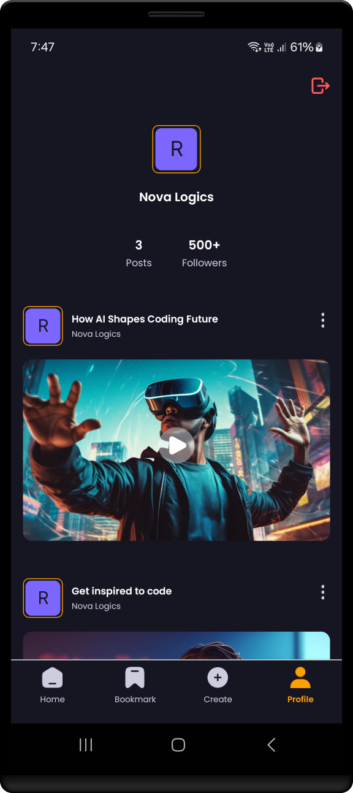

<h1 align="center" >  VidBox App   ♨ [ ʀᴇᴀᴄᴛ ɴᴀᴛɪᴠᴇ ᴇxᴘᴏ ᴘʀᴏᴊᴇᴄᴛ ] ♨</h1>

## Stage 11: Feature Profile Screen  
**Log:** January 15, 2025  
This stage is about creating a personalized Profile Screen for the app. Users will be able to view their details and log out of the app seamlessly.  

### Step-by-Step Process  

1. **Implement the Basic UI for the Profile Screen**  
   Design the layout of the Profile Screen, ensuring it is clean and user-friendly.  
   **File:** `/app/(tabs)/profile.jsx`  
   **Link:** [profile.jsx ->](./app/(tabs)/profile.jsx)  
      
    
   
   ---  

2. **Add a Custom Component 'InfoBox'**  
   Create a reusable `InfoBox` component to display user details like name, email, etc., in an organized manner.  
   **File:** `/components/InfoBox.jsx`  
   **Link:** [InfoBox.jsx ->](./components/InfoBox.jsx)  
      
    
   
   ---  

3. **Add SignOut Logic to Appwrite**  
   Implement the backend functionality for user sign-out. This logic will allow users to securely log out from their accounts.  
   **File:** `/app/appwrite.jsx`  
   **Link:** [appwrite.jsx ->](./app/appwrite.jsx)  
      
    
   
   ---  

4. **Apply SignOut Logic to the Profile Screen**  
   Integrate the `signOut` functionality into the Profile Screen, providing users with an easy way to log out.  
   **File:** `/app/(tabs)/profile.jsx`  
   **Link:** [profile.jsx ->](./app/(tabs)/profile.jsx)  
      
    

   --- 

 

---

 

### PROFILE SCREEN

 

### OTHER SCREENS

 

---

See you in the next step for the development process! 🚀  

---