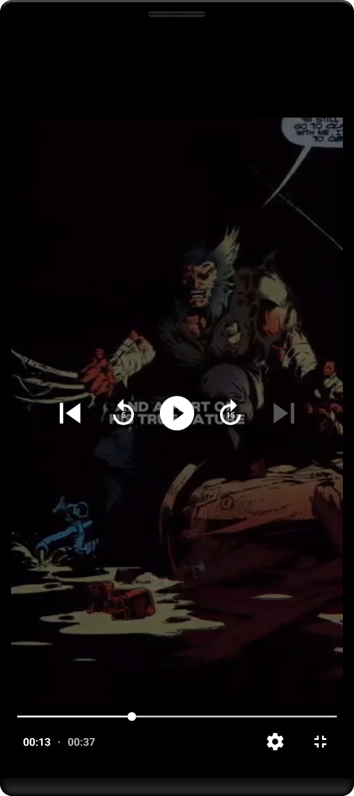

<h1 align="center" >  VidBox App   ♨ [ ʀᴇᴀᴄᴛ ɴᴀᴛɪᴠᴇ á´‡xᴘᴠᴘʀá´á´Šá´‡á´„á´› ] ♨</h1>

## Stage 06: Auth Screens UI Implementation 
**Log:** January 12, 2025  

This stage focuses on implementing the UI for the authentication screens, including the creation of reusable components like the form fields and the actual sign-in and sign-up screens.  

---

## Step-by-Step Process  

### 1. Custom Component: [FormField: Input Field] for Auth Screens UI  
A custom reusable input field component (`FormField`) for the authentication screens has been implemented in:  
**File Location**: `/components/FormField.jsx`  
👉 [View the `FormField.jsx` code here](./components/FormField.jsx)  

---

### 2. SignIn Screen UI  
The SignIn screen UI has been implemented in:  
**File Location**: `/app/(auth)/sign-in.jsx`  
👉 [View the `sign-in.jsx` code here](./app/(auth)/sign-in.jsx)  

---

### 3. SignUp Screen UI  
The SignUp screen UI has been implemented in:  
**File Location**: `/app/(auth)/sign-up.jsx`  
👉 [View the `sign-up.jsx` code here](./app/(auth)/sign-up.jsx)  

---

### 4. SignIn and SignUp Added to AuthLayout  
The SignIn and SignUp screens have been added to the AuthLayout in:  
**File Location**: `/app/(auth)/_layout.jsx`  
👉 [View the `_layout.jsx` code here](./app/(auth)/_layout.jsx)  

---

 

---
 

🚀 See You in the Next Step for the Development Process!  

