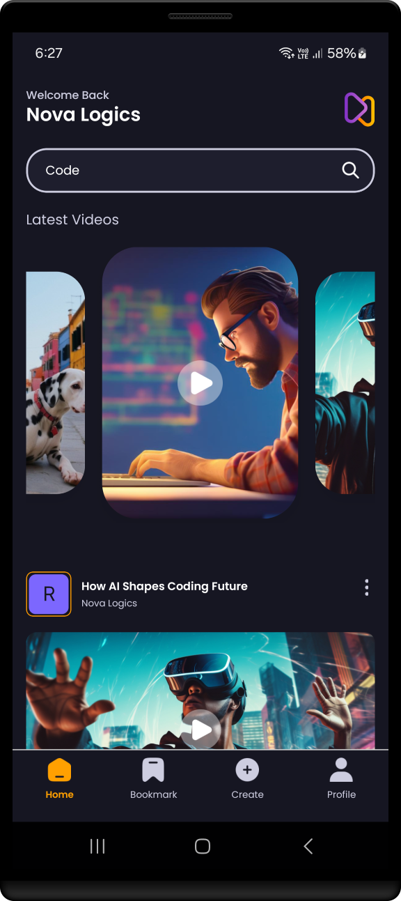

<h1 align="center" >  VidBox App   ♨ [ ʀᴇᴀᴄᴛ ɴᴀᴛɪᴠᴇ ᴇxᴘᴏ ᴘʀᴏᴊᴇᴄᴛ ] ♨</h1>

## Stage 10: Feature Search Screen  

**Log:** January 15, 2025  
This stage focuses on implementing the search functionality, enabling users to search for videos dynamically. We'll create a search input, apply backend logic, and integrate it into the app seamlessly.  

---

### Step-by-Step Process  

1. **Create the SearchInput Component**  
Build a reusable component to handle user input for searches.  
   **File:** `/components/SearchInput.jsx`  
   **Link:** [SearchInput.jsx ->](./components/SearchInput.jsx)  
   
    
   
   ---  

1. **Design and Implement the Search Screen**  
   Create a visually appealing and functional search screen that displays results based on user queries.  
   **File:** `/app/search/[query].jsx`  
   **Link:** [[query].jsx ->](./app/search/[query].jsx)  
   
    
   
   ---  

2. **Add Search Logic to Appwrite**  
   Implement the backend functionality to fetch search results dynamically. This will allow the app to communicate with the server for relevant data.  
   **File:** `/app/appwrite.jsx`  
   **Link:** [appwrite.jsx ->](./app/appwrite.jsx) 

    
   
   ---  

3. **Update Index Settings on Appwrite**  
   Go to [Appwrite Cloud](https://cloud.appwrite.io/) and configure your video collection's index settings for efficient searching. Use the settings shown below:  
   
  
        
   
  

    

   ---  

4. **Connect Search Logic to the Search Screen**  
   Integrate the search functionality into the search screen so users can see live results based on their input.  
   **File:** `/app/search/[query].jsx`  
   **Link:** [[query].jsx ->](./app/search/[query].jsx)  

    
   
   ---  
 

 

---

 

 

---

See you in the next step for the development process! 🚀  

---